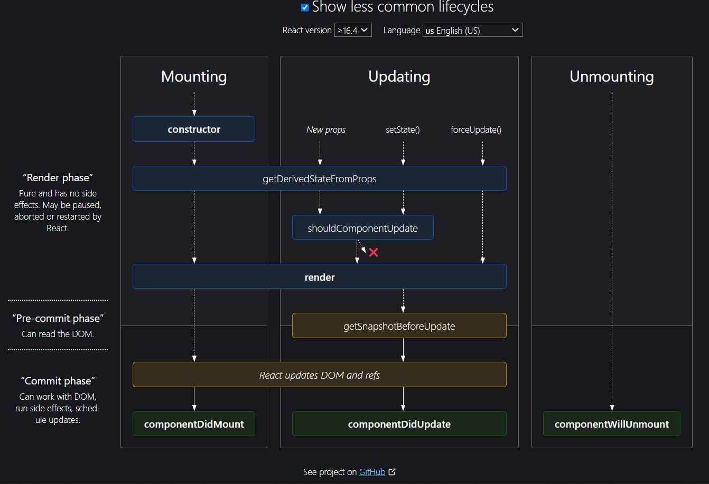

[Back to Content](../README.md)

# Life-Cycle Phases
[](https://projects.wojtekmaj.pl/react-lifecycle-methods-diagram/)
The lifecycle of the component is divided into three phases. They are:

<details>

<summary>Mounting Phase</summary>

- In this phase, the instance of a component is created and inserted into the DOM. This phase contains a set of methods which get invoked when the component is getting initialized, and loaded on to the DOM:
    - `constructor`: 
        - This is the first method that gets called whenever a component is created. The constructor is called only once in the whole lifecycle of a component.
        - Usage: Setup the initial state of the component.
        - eg:
            ```javascript
            class ContraMusicPlayer extends React.Component
            constructor(props) {
            super(props);
            this.state = {
                volume: 70,
                status: 'pause'
            }
            }
            ```
    - `static getDerivedStateFromProps`:
        - This method is invoked after the constructor and is expected to return an object to update the state of the component. If null is returned then, nothing is changed in the state.
        - is static, hence it has no access to `this`. This method has access to the current state and props. Hence, if the state is dependent on props then the state can be updated here.
        - Usage: Keep the state synced with incoming props. This method is a safer replacement of `componentWillReceiveProps`. This method is a pure function, hence nothing should be written which creates side effects.
        - eg:
            ```javascript
            static getDerivedStateFromProps(props, state) {
            if (state.value !== props.value) {
                return {
                    derivedValue: deriveValueFromProps(props),
                    mirroredProp: props.value
                }
                }
            // when null is returned no update is made to the state
            return null;
            }
            // after getDerivedStateFromProps the state looks like as follows:
            //   {
            //    derivedValue: someValue,
            //    mirrordValue: newPropValue
            //   }
            ```
    - render:
        - This is the required method in a React component, as this method prepares the element that gets mounted on to the browser DOM.
        - This method is pure, which means it gives the same output every time the same input is provided. This method should not result in any side effect like changing state.
        - eg:
            ```javascript
            render() {
            <div>
                <PlayHeader>
                <Status/>
                <VolumeBar/>
                <SeekBar/>
                </PlayHeader>
            </div>
            }
            ```
    - componentDidMount:
        - This is the hook method which is invoked immediately after the component did mount on the browser DOM.
        - Usage: All the interaction directly with the browser DOM and integrate with third-party libraries should be done here. The API calls should be made in componentDidMount method always.
        - eg:
            ```javascript
            componentDidMount() {
            if (this.props.modules) {
                        this.props.modules.forEach(function (module) {
                            module(Highcharts);
                        });
                    }
                    // Set container which the chart should render to.
                    this.chart = new Highcharts[this.props.type || "Chart"](
                        this.props.container, 
                        this.props.options
                    );
            }
            ```

</details>

<details>

<summary>Updating Phase</summary>

- This phase starts when the react component has taken birth on the browser and grows by receiving new updates. The component can be updated in two ways, sending new props from parents or updating the current state. The main aim of this phase is to ensure that the component is displaying the latest version of itself. This phase consists of the following methods:
    - `static getDerivedStateFromProps`: same as discussed above
    - `shouldComponentUpdate`: 
        - This method tells React that when the component is being updated, it should re-render or skip rendering altogether. If this method returns true, the component will update. Otherwise, the component will skip the updating.
        - Usage: The example is one of the cases where the render is quite costly and we would like to re-render the component only when the props status changes.
        - eg:
            ```javascript
            shouldComponentUpdate(nextProps, nextState) {
            let shouldUpdate = this.props.status !== nextProps.status;
            return shouldUpdate;
            }
            ```
    - `render`: It is invoked to examine this.props and this.state and return one of the following types: React elements, Arrays and fragments, Booleans or null, String and Number. If shouldComponentUpdate() returns false, the code inside render() will be invoked again to ensure that the component displays itself properly.
    - `getSnapshotBeforeUpdate`:
        - This method gets called after the render created the React element and before it is actually updated from virtual DOM to actual DOM. This phase is known as pre-commit phase.
        - This method has access to both previous and current props and state. If the method getSnapshotBeforeUpdate returns a value, the same is available in componentDidUpdate as the third parameter, where the UI can be updated to make is synced before and after render.
        - Usage: This method is useful if you want to keep sync in-between state of current DOM with the updated DOM. E.g. scroll position, audio/video, text-selection, cursor position, tool-tip position, etc.
        - for more info: https://github.com/reactjs/rfcs/blob/main/text/0033-new-commit-phase-lifecycles.md#basic-example
        - eg:
            ```javascript
                        
            type Snapshot = number | null;

            class ScrollingList extends React.Component<Props, State, Snapshot> {
            listRef = React.createRef();

            getSnapshotBeforeUpdate(
                prevProps: Props,
                prevState: State
            ): Snapshot {
                // Are we adding new items to the list?
                // Capture the current height of the list so we can adjust scroll later.
                if (prevProps.list.length < this.props.list.length) {
                return this.listRef.value.scrollHeight;
                }

                return null;
            }

            componentDidUpdate(
                prevProps: Props,
                prevState: State,
                snapshot: Snapshot
            ) {
                // If we have a snapshot value, then we've just added new items.
                // Adjust scroll so these new items don't push the old ones out of view.
                if (snapshot !== null) {
                this.listRef.value.scrollTop +=
                    this.listRef.value.scrollHeight - snapshot;
                }
            }

            render() {
                return (
                <div ref={this.listRef}>{/* ...contents... */}</div>
                );
            }
            }
            ```
    - `componentDidUpdate`:
        - is executed when the newly updated component has been updated in the DOM.
        - This method is used to re-trigger the third party libraries used, and to make sure these libraries also update and reload themselves.
        - Usage: The use cases are mostly similar to the use case of componentDidMount to keep the third party library or UI in sync with every update.

</details>

<details>

<summary>Unmounting Phase</summary>

- It is the final phase of the react component lifecycle.In this phase, the component is not needed and is called when a component instance is destroyed and unmounted from the DOM. This phase contains only one method and is given below:
    - `componentWillUnmount`:
        - This method is the last method in the lifecycle. This is executed just before the component gets removed from the DOM. 
        - It performs any necessary cleanup related task such as invalidating timers, event listener, canceling network requests, or cleaning up DOM elements. If a component instance is unmounted, you cannot mount it again.
        - For example, on log out, the user details and all the auth tokens can be cleared before unmounting the main component.
        - eg:
            ```javascript
            componentWillUnmount() {
                this.chart.destroy();
                this.resetLocalStorage();
                this.clearSession();
            }
            ```

</details>


### Life-Cycle Methods for Function based Components

- The above given Life-cycle methods work for Class based components
- alternatives for Function-based components is using the `useEffect` hook which takes two arguments - a callback function and a dependency array, where the dependency array is optional
- By using this hook, we can create functionality similar to componentDidMount, componentDidUpdate, and componentWillUnmount. eg:
    - `componentDidMount` lifecycle method:
        - Empty dependency array means that the hook will execute only once and it will be during the component mounting.
        - eg:
            ```javascript
            import { useEffect } from "react";
            const CompExample = () => {

            useEffect(() => {
                console.log("This code will execute when the component is mounted");
            }, []);

            return <h1> Hello World! </h1>;
            };
            export default CompExample;
            ```
        - notice the useEffect() hook:
            ```javascript
            useEffect(() => {
                console.log("This code will execute when the component is mounted");
            }, []);
            ```
    - `componentDidUpdate` lifecycle method:
        - the useEffect hook that has no dependency array provided will execute only when the component re-renders.
        - eg:
            ```javascript
            useEffect(() => {
                console.log("This code will execute when the component updates");
            });
            ```
        - We can provide an argument to it and it will execute only when the value of that argument is changed. We can do this in the functional component by adding a value(s) in the dependency array.
        - eg:
            ```javascript
            useEffect(() => {
                console.log("This code will execute when the component updates");
            }, [counter]);
            ```
        - here the useEffect() hook will execute only when the value of “counter” is changed.
    - `componentWillUnmount` lifecycle method:
        - we have to return a function from the useEffect() hook. This function will execute only when the component is removed from the DOM tree, thus making it similar to the componentWillUnmount lifecycle method.
        - eg:
        ```javascript
        useEffect(() => {
            return () => {
            console.log("Behavior right before the component is removed from the DOM.");
        }
        }, []);
        ```


[Previous](../Props/README.md)
<br>

[Next]()